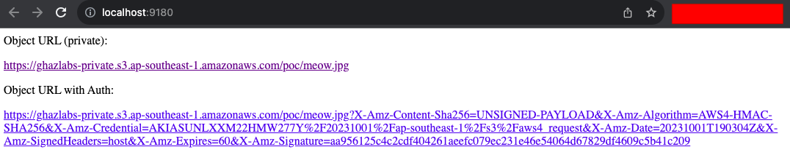

# Contoh Kode Akses Private S3 Object di PHP

Tidak semua objek di S3 harus publicly read accessible supaya bisa diakses oleh aplikasi yang kita buat.

Bahkan untuk beberapa objek yang berisi data sensitif (misal: KTP, foto selfie KTP, dll), wajib untuk dibuat private.

Nah di repo ini saya akan memberikan contoh kode untuk mengakses objek S3 yang private dengan menggunakan PHP. Intinya adalah kita akan membuat presigned URL yang akan kita gunakan untuk mengakses objek S3 tersebut.

## Komponen Yang Diperlukan

1. Objek S3 yang sudah dibuat private read => Pada repo ini kita akan mencoba untuk mengakses [gambar ini](https://ghazlabs-private.s3.ap-southeast-1.amazonaws.com/poc/meow.jpg).
2. IAM User atau roles yang memiliki akses ke objek S3 tersebut => Lihat [disini](#iam-policy) untuk detail dari IAM Policy yang dibutuhkan.
3. Kode PHP untuk membuat presigned URL => Pada intinya hanya [ini kodenya](./src/index.php#L19-L45).

## IAM Policy

Berikut ini adalah IAM Policy minimum yang diperlukan untuk mengakses objek S3 yang private dengan menggunakan presigned URL:

```json
{
	"Version": "2012-10-17",
	"Statement": [
		{
			"Sid": "AllowAccessToPrivateS3Object",
			"Effect": "Allow",
			"Action": [
				"s3:GetObject",
				"s3:ListBucket"
			],
			"Resource": [
				"arn:aws:s3:::<nama-s3-bucket-kamu>/*"
			]
		}
	]
}
```

## Demo Program

Untuk demo program bisa diakses secara online [disini]().

Kalau mau coba-coba sendiri di local, ikuti langkah-langkah berikut:

1. Pastikan kamu sudah menginstall `Docker` & `Make`.
2. Set environment variable: `POC_S3_AWS_ACCESS_KEY_ID` & `POC_S3_AWS_SECRET_ACCESS_KEY` dengan AWS Access Key ID & AWS Secret Access Key yang memiliki akses seperti sesuai dengan [IAM Policy diatas](#iam-policy).
3. Jalankan perintah `make run` untuk menjalankan programnya.
4. Buka browser dan akses `http://localhost:9114`.

